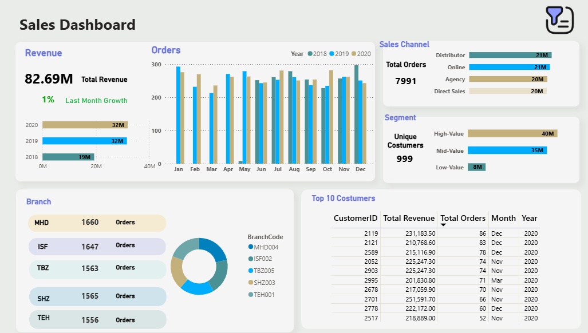

# 📈 Faragir Sanat Mehrbin Sales Performance & Customer Segmentation Dashboard (2018–2020)

# 📚 Table of Contents

  - [🔖 Project Overview](#project-overview)
  - [📂 Step 1. Dataset & Table Structure](#step-1-dataset--table-structure)
  - [🧹 Step 2. Data Cleaning Pipeline (Steps 01–07)](#step-2-data-cleaning-pipeline-steps-01–07)
  - [📊 Step 3. Sales KPIs Analysis](#step-3-sales-kpis-analysis)
    - [🧮 Code: Overall KPIs](#code-overall-kpis)
    - [📊 Revenue Breakdown by Sales Channel](#revenue-breakdown-by-sales-channel)
    - [📅 Monthly Revenue Aggregation](#monthly-revenue-aggregation)
    - [🥇 Top 10 Customers by Revenue](#top-10-customers-by-revenue)
  - [🎯 Step 4. Customer Segmentation using RFM](#step-4-customer-segmentation-using-rfm)
  - [🔍 Step 5. Advanced Sales & Operational Analysis](#step-5-advanced-sales--operational-analysis)
  - [📊 Step 6. Power BI Dashboard](#power-bi-dashboard)
 

## 🔖 Project Overview

This project presents a comprehensive analysis of sales performance and customer behavior for Faragir Sanat Mehrbin, a laboratory equipment manufacturing company. The objective is to clean raw transactional data, generate actionable KPIs, and create segmentation and trend insights that can drive business decisions.

Using SQL, we processed and analyzed 3 years of transaction-level data (2018–2020), building views and reports for integration into dashboards (Power BI). Final outputs were saved as `.xlsx` files and structured for business intelligence reporting.

---

## 📂 Step 1 .Dataset & Table Structure

The dataset was imported into a SQL database and structured using the following table:

```sql
CREATE TABLE sales_data (
  InvoiceNumber TEXT,
  SalesChannel TEXT,
  WarehouseLocationCode TEXT,
  ProcurementDate TEXT,
  SalesOrderDate TEXT,
  DispatchDate TEXT,
  DeliveryDate TEXT,
  Currency TEXT,
  SalesRepID INTEGER,
  CustomerID INTEGER,
  BranchCode TEXT,
  ProductCode INTEGER,
  QuantityOrdered INTEGER,
  DiscountRate REAL,
  UnitSalePrice REAL,
  UnitProductionCost REAL
);
```

---

## 🧹 Step 2.Data Cleaning Pipeline (Steps 01–07)

The raw data underwent structured cleaning:

```sql
-- 01. Remove rows with NULLs in critical fields
DELETE FROM sales_data
WHERE
  InvoiceNumber IS NULL OR
  SalesOrderDate IS NULL OR
  CustomerID IS NULL OR
  ProductCode IS NULL;

-- 02. Remove rows where price or quantity is zero or negative
DELETE FROM sales_data
WHERE
  UnitSalePrice IS NULL OR UnitSalePrice <= 0 OR
  QuantityOrdered IS NULL OR QuantityOrdered <= 0;

-- 03. Standardise date formats (if any slashes exist, replace with dashes)
-- This is only useful if the data was imported with slashes (e.g., '2018/05/31')
UPDATE sales_data
SET SalesOrderDate = REPLACE(SalesOrderDate, '/', '-')
WHERE SalesOrderDate LIKE '%/%';

-- 04. Trim extra spaces from text fields
UPDATE sales_data
SET
  InvoiceNumber = TRIM(InvoiceNumber),
  SalesChannel = TRIM(SalesChannel),
  WarehouseLocationCode = TRIM(WarehouseLocationCode),
  ProductCode = TRIM(ProductCode),
  ProductGroup = TRIM(ProductGroup),
  ProductCategory = TRIM(ProductCategory),
  ProductSubCategory = TRIM(ProductSubCategory),
  ProductDescription = TRIM(ProductDescription),
  Currency = TRIM(Currency);

-- 05. Remove duplicate rows based on InvoiceNumber + CustomerID + ProductCode
-- Keeps the first occurrence only (based on rowid)
DELETE FROM sales_data
WHERE rowid NOT IN (
  SELECT MIN(rowid)
  FROM sales_data
  GROUP BY InvoiceNumber, CustomerID, ProductCode
);

-- 06. Keep only IRR currency rows (filter out other currencies)
DELETE FROM sales_data
WHERE Currency != 'IRR';

-- 07. Keep only rows within the 2018–2020 range
-- Optional: Adjust this based on project scope
DELETE FROM sales_data
WHERE SalesOrderDate < '2018-01-01' OR SalesOrderDate > '2020-12-31';
```


---
## 📊 Step 3.Sales KPIs Analysis

Understanding key performance indicators (KPIs) is crucial for any business. For **Faragir Sanat Mehrbin**, we calculated foundational KPIs using SQL to assess:

- Order volume  
- Customer base  
- Revenue  
- Average order size  

---

### 🧮 Code: Overall KPIs

```sql
-- Overall KPIs: Total Orders, Unique Customers, Revenue & AOV
SELECT
  COUNT(DISTINCT InvoiceNumber) AS total_orders,
  COUNT(DISTINCT CustomerID) AS unique_customers,
  ROUND(SUM(QuantityOrdered * UnitSalePrice), 2) AS total_revenue,
  ROUND(AVG(QuantityOrdered * UnitSalePrice), 2) AS avg_order_value
FROM sales_data;
```

---

### 📎 Output :

<details>
<summary>📊 Output Preview: Click to expand</summary>

<div style="overflow-x: auto">

| total_orders | unique_customers | total_revenue   | avg_order_value |
|--------------|------------------|------------------|-----------------|
| 7991         | 999              | 82,692,726.60    | 10,348.23       |

</div>
</details>

---

### 📊 Revenue Breakdown by Sales Channel

Understanding the revenue contribution of each sales channel enables **Faragir Sanat Mehrbin** to optimize resource allocation and tailor sales strategies. This section calculates the number of orders and total revenue per channel.

---

### 🧮 Code

```sql
-- Revenue Breakdown by Sales Channel
SELECT
  SalesChannel,
  COUNT(DISTINCT InvoiceNumber) AS total_orders,
  SUM(QuantityOrdered * UnitSalePrice) AS revenue
FROM sales_data
GROUP BY SalesChannel;
```

---

### 📎 Output:

<details>
<summary>📊 Output </summary>

<div style="overflow-x: auto">

| SalesChannel  | total_orders | revenue        |
|---------------|--------------|----------------|
| Distributor   | 2,038        | 21,388,088.40  |
| Online        | 2,041        | 20,943,617.10  |
| Agency        | 1,952        | 20,248,639.50  |
| Direct Sales  | 1,960        | 20,112,381.60  |

</div>
</details>

📁 **Full dataset available in** `sales KPI .xlsx` → **Sheet:** `Sales Channel Revenue`

### 📊 Revenue Breakdown by BranchCode

Understanding the revenue contribution of each branch enables **Faragir Sanat Mehrbin** to identify high-performing locations and guide strategic investment. This section calculates the number of orders, total revenue, and each branch’s percentage contribution to overall sales.

---

### 🧮 Code

```sql
-- Revenue Breakdown by Branchcode
SELECT
  BranchCode,
  ROUND(SUM(QuantityOrdered * UnitSalePrice), 2) AS total_revenue,
  COUNT(DISTINCT InvoiceNumber) AS total_orders,
  ROUND(
    SUM(QuantityOrdered * UnitSalePrice) * 100.0 /
    (SELECT SUM(QuantityOrdered * UnitSalePrice) FROM sales_data), 1
  ) AS revenue_percent
FROM sales_data
GROUP BY BranchCode
ORDER BY total_revenue DESC;
```

---

### 📎 Output:

<details>
<summary>📊 Output </summary>

<div style="overflow-x: auto">

| BranchCode | total_revenue  | total_orders | revenue_percent |
|------------|---------------:|-------------:|----------------:|
| MHD004     | 17,577,463.4   | 1,660        | 21.3            |
| ISF002     | 16,812,732.1   | 1,647        | 20.3            |
| TBZ005     | 16,437,873.8   | 1,563        | 19.9            |
| SHZ003     | 16,007,197.8   | 1,565        | 19.4            |
| TEH001     | 15,857,459.5   | 1,556        | 19.2            |

</div>
</details>

📁 **Full dataset available in** `sales KPI .xlsx` → **Sheet:** `Revenue by Branch Code`

### 📅 Monthly Revenue Aggregation

Analyzing revenue trends over time helps Faragir Sanat Mehrbin identify seasonality, growth periods, and periods requiring strategic intervention. This query aggregates total monthly revenue based on the `SalesOrderDate`.

---

### 🧮 Code

```sql
-- Monthly Revenue Trend
SELECT
  SUBSTR(SalesOrderDate, 1, 7) AS month,
  ROUND(SUM(QuantityOrdered * UnitSalePrice), 2) AS monthly_revenue
FROM sales_data
GROUP BY month
ORDER BY month;
```

---

### 📎 Output:

<details>
<summary>📊 Output Preview: Click to expand</summary>

<div style="overflow-x: auto">

| month     | monthly_revenue |
|-----------|------------------|
| 2018-05   | 75629.6   |
| 2018-06   | 2454752.7  |
| 2018-07  | 2707550.4    |
| ...       | ...           |
| 2020-11   | 2977607.3     |
| 2020-12   | 3046617.3     |

</div>
</details>

📁 **Full dataset available in** `sales KPI .xlsx` → **Sheet:** `Monthly Revenue`

### 🥇 Top 10 Customers by Revenue

Identifying top-paying customers helps **Faragir Sanat Mehrbin** prioritize key accounts, tailor loyalty strategies, and understand high-value client behavior. This section extracts the top 10 customers based on total purchase value.

---

### 🧮 Code

```sql
-- Top 10 Customers by Total Revenue
SELECT
  CustomerID,
  SUM(QuantityOrdered * UnitSalePrice) AS customer_revenue
FROM sales_data
GROUP BY CustomerID
ORDER BY customer_revenue DESC
LIMIT 10;
```

---

### 📎 Output:

<details>
<summary>📊 Output Preview: Click to expand</summary>
<div style="overflow-x: auto">

| CustomerID | customer_revenue |
|------------|------------------|
| 2701       | 251,591.70       |
| 2119       | 231,183.50       |
| 2903       | 225,247.30       |
| 2052       | 225,247.30       |
| 2778       | 222,172.00       |
| 2517       | 218,889.00       |
| 2678       | 217,059.90       |
| 2589       | 215,116.90       |
| 2121       | 210,768.60       |
| 2995       | 201,830.80       |

</div>
</details>

📁 Full dataset available in the sheet `"Top 10 Customers"` inside the **sales KPI.xlsx** file.


## 🎯 Step 4.Customer Segmentation using RFM

Segmenting customers based on **Recency**, **Frequency**, and **Monetary Value** (RFM) allows *Faragir Sanat Mehrbin* to target campaigns more effectively, retain valuable clients, and re-engage churned customers.

---

### 🧮 Code: RFM Segmentation in SQL

```sql
-- Step 1: Create RFM base table
CREATE VIEW vw_customer_rfm AS
SELECT
  CustomerID,
  ROUND(JULIANDAY('now') - JULIANDAY(MAX(SalesOrderDate))) AS recency,
  COUNT(*) AS frequency,
  ROUND(SUM(QuantityOrdered * UnitSalePrice), 2) AS monetary
FROM sales_data
GROUP BY CustomerID;

-- Step 2: Add RFM Segment Labels
SELECT *,
  CASE
    WHEN recency <= 30 THEN 'New'
    WHEN recency <= 90 THEN 'Active'
    WHEN recency <= 180 THEN 'At Risk'
    ELSE 'Churned'
  END AS recency_segment,
  CASE
    WHEN frequency >= 10 THEN 'Loyal'
    WHEN frequency >= 5 THEN 'Returning'
    ELSE 'One-Time'
  END AS frequency_segment,
  CASE
    WHEN monetary >= 100000 THEN 'High-Value'
    WHEN monetary >= 50000 THEN 'Mid-Value'
    ELSE 'Low-Value'
  END AS monetary_segment
FROM vw_customer_rfm;
```

---

### 📎 Output Preview

<details>
<summary>📊 Click to expand</summary>

<div style="overflow-x: auto">

| CustomerID | recency | frequency | monetary  | recency_segment | frequency_segment | monetary_segment |
|------------|---------|-----------|-----------|------------------|-------------------|------------------|
| 2000       | 1882    | 5         | 65,010.10 | Churned          | Returning         | Mid-Value        |
| 2001       | 1821    | 7         | 70,169.10 | Churned          | Returning         | Mid-Value        |
| 2002       | 1759    | 6         | 88,406.50 | Churned          | Returning         | Mid-Value        |
| 2003       | 1911    | 5         | 31,999.20 | Churned          | Returning         | Low-Value        |
| 2004       | 1695    | 13        |153,054.80 | Churned          | Loyal             | High-Value       |
| 2005       | 1726    | 5         | 70,316.50 | Churned          | Returning         | Mid-Value        |
| 2006       | 1865    | 11        |110,154.70 | Churned          | Loyal             | High-Value       |
| 2007       | 1692    | 10        | 64,722.00 | Churned          | Loyal             | Mid-Value        |
| 2008       | 2101    | 9         |114,744.20 | Churned          | Returning         | High-Value       |
| 2009       | 1689    | 15        |128,358.60 | Churned          | Loyal             | High-Value       |
| 2010       | 1696    | 9         |103,474.80 | Churned          | Returning         | High-Value       |
| 2011       | 1818    | 6         | 79,830.50 | Churned          | Returning         | Mid-Value        |
| 2012       | 1805    | 12        |110,409.30 | Churned          | Loyal             | High-Value       |
| .......      | .......    | .......       |....... | .......         | .......           | .......        |

</div>
</details>

📁 Full segmentation results are available in the `customer segmentation.xlsx` file.


## 🔍 Step 5.Advanced Sales & Operational Analysis

To extract deeper insights from the sales dataset, a set of advanced SQL queries were developed to evaluate profitability, delivery efficiency, representative performance, repeat customer rate, and financial health over time.

---

### 🧠 SQL Code

```sql
-- 🔍 Identify the top products based on profit (revenue - production cost)
SELECT
  ProductCode,
  ROUND(SUM((UnitSalePrice - UnitProductionCost) * QuantityOrdered), 2) AS total_profit,
  ROUND(SUM(QuantityOrdered * UnitSalePrice), 2) AS total_revenue,
  ROUND(SUM(QuantityOrdered * UnitProductionCost), 2) AS total_cost
FROM sales_data
GROUP BY ProductCode
ORDER BY total_profit DESC
LIMIT 10;

-- 🚚 Evaluate operational efficiency by measuring delivery time in days
SELECT
  BranchCode,
  ROUND(AVG(JULIANDAY(DeliveryDate) - JULIANDAY(DispatchDate)), 2) AS avg_delivery_days,
  COUNT(*) AS total_orders
FROM sales_data
WHERE DeliveryDate IS NOT NULL AND DispatchDate IS NOT NULL
GROUP BY BranchCode
ORDER BY avg_delivery_days;

-- 💼 Assess sales representatives by revenue and how much discount they give
SELECT
  SalesRepID,
  ROUND(SUM(QuantityOrdered * UnitSalePrice), 2) AS total_revenue,
  ROUND(SUM(QuantityOrdered * UnitSalePrice * DiscountRate), 2) AS total_discount_given,
  COUNT(DISTINCT CustomerID) AS served_customers
FROM sales_data
GROUP BY SalesRepID
ORDER BY total_revenue DESC;

-- 🔁 How many customers placed more than one order?
SELECT
  COUNT(*) * 100.0 / (SELECT COUNT(DISTINCT CustomerID) FROM sales_data) AS repeat_customer_percentage
FROM (
  SELECT CustomerID
  FROM sales_data
  GROUP BY CustomerID
  HAVING COUNT(DISTINCT InvoiceNumber) > 1
);

-- 📈 Financial health: Revenue vs cost per month
SELECT
  DATE(SalesOrderDate, 'start of month') AS month,
  ROUND(SUM((UnitSalePrice - UnitProductionCost) * QuantityOrdered), 2) AS gross_profit,
  ROUND(SUM(UnitSalePrice * QuantityOrdered), 2) AS revenue,
  ROUND(SUM(UnitProductionCost * QuantityOrdered), 2) AS production_cost,
  ROUND(
    SUM((UnitSalePrice - UnitProductionCost) * QuantityOrdered) * 100.0 /
    NULLIF(SUM(UnitSalePrice * QuantityOrdered), 0), 2
  ) AS gross_margin_percent
FROM sales_data
GROUP BY month
ORDER BY month;
```

---

### 📎 Output Previews

<details><summary>💰 Top 10 Most Profitable Products</summary>

| ProductCode | total_profit | total_revenue | total_cost |
|------------ |--------------|----------------|-------------|
| 1010        | 434,924.47   | 1,088,267.60    | 653,343.13   |
| 1004        | 428,063.67   | 1,149,277.80    | 721,214.13   |
| 1071        | 424,500.81   | 1,075,772.10    | 651,271.29   |
| 1091        | 404,410.79   | 986,494.60      | 582,083.81   |
| 1062        | 395,708.16   | 1,070,371.90    | 674,663.74   |
| 1041        | 394,044.89   | 1,072,596.30    | 678,551.41   |
| 1049        | 388,628.41   | 1,008,222.70    | 619,594.29   |
| 1070        | 388,394.58   | 975,285.50      | 586,890.92   |
| 1063        | 376,479.50   | 953,550.70      | 577,071.20   |
| 1088        | 358,813.34   | 979,486.40      | 620,673.06   |

</details>

<details><summary>🚚 Branch-Level Delivery Efficiency</summary>

| BranchCode | avg_delivery_days | total_orders |
|------------|-------------------|--------------|
| TBZ005     | 5.44              | 1,563        |
| ISF002     | 5.46              | 1,647        |
| SHZ003     | 5.52              | 1,565        |
| MHD004     | 5.53              | 1,660        |
| TEH001     | 5.57              | 1,556        |

</details>

<details><summary>💼 Sales Representative Performance</summary>

| SalesRepID | total_revenue | total_discount_given | served_customers |
|------------|----------------|-----------------------|-------------------|
| 26       | 3346569.6   |366156.17            | 255             |
| 1       | 3261359    | 435669.68          | 255              |
| 13       | 3242525.3   |423124.1          | 276              |
| ...       | ...    | ...           | ...              |

</details>

<details><summary>🔁 Repeat Customers</summary>

**📌 Repeat customer rate:** **99.89%**

</details>

<details><summary>📈 Monthly Financial Summary</summary>

| month     | gross_profit | revenue    | production_cost | gross_margin_percent |
|-----------|-------------:|-----------:|----------------:|---------------------:|
| 5/1/2018  |    24264.45  |   75629.6  |     51365.15    |          32.08       |
| 6/1/2018  |   903955.49  | 2454752.7  |   1550797.21    |          36.82       |
| 7/1/2018  |  1013208.10  | 2707550.4  |   1694342.30    |          37.42       |
| 8/1/2018  |  1076989.82  | 2909421.4  |   1832431.57    |          37.02       |
| ...  |  ...  | ...  |   ...   |         ...       |

</details>

---

📁 *Raw results exported as* `advance analysis.xlsx` *for integration with Power BI dashboards and final report delivery.*


## 📊 Step 6.Views for Power BI Dashboard

After cleaning and transforming the data using SQL and RFM techniques, the final datasets were imported into Power BI to create an interactive sales performance dashboard. This dashboard integrates all key metrics, including revenue trends, sales channel analysis, branch performance, customer segmentation, and top customer analysis.

The Power BI dashboard was built using the tables and views created in the previous steps, along with additional DAX formulas for dynamic calculations and segmentation. The dashboard file and published link are both available in the dashboard folder of this repository.

🔗 Access the dashboard file and online report:

* Power BI dashboard file: 
* [View Interactive Power BI Dashboard](https://app.powerbi.com/view?r=eyJrIjoiMDVkZDg5ZjktZmJmNy00YmZhLTkzOGMtNDBiMjhiZTNkYWRiIiwidCI6IjdkZTgzYmUxLWYyMTktNDBiNi1hNzJmLWU0Y2Q2ZjMwMDMyOSJ9)
